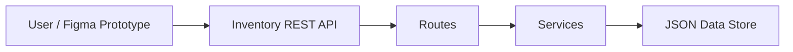
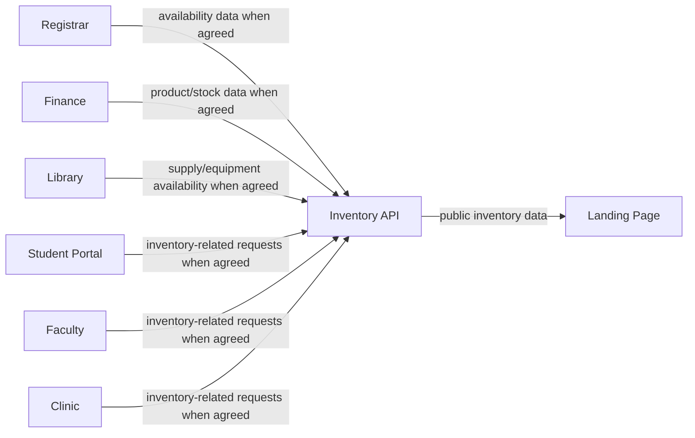

# Inventory Architecture

## 1. Module responsibility

Inventory is the source of truth for:

- products owned by the Inventory module;
- current stock quantity;
- stock-in and stock-out movements;
- product availability;
- low-stock status.

Other modules should not maintain a second authoritative copy of Inventory stock.

## 2. Runtime architecture



The required backend layering is:

```text
HTTP request
    ↓
routes/
    ↓
services/
    ↓
data/store.json
```

Routes handle HTTP concerns and validation. Services contain business rules. The data layer reads/writes the mock JSON store.

## 3. Integration architecture



The arrows above describe integration responsibilities to be finalized in the class agreements log. Inventory exposes read-only inventory data through:

```text
GET /api/v1/integration/inventory
```

## 4. Backend components

| Component | Responsibility |
|---|---|
| `public/index.php` | Creates Slim application and registers dependencies/routes |
| `routes/*.php` | HTTP endpoints, validation, response mapping |
| `services/ProductService.php` | Product CRUD rules |
| `services/StockService.php` | Stock movement and integration rules |
| `services/JsonStore.php` | Mock-data persistence |
| `services/ProblemDetails.php` | Standard 400/404 error payload |
| `data/store.json` | Mock products and stock movements |
| `public/openapi.yaml` | API contract |
| `public/docs/index.html` | Swagger UI |

## 5. Frontend structure

The midterm frontend is a high-fidelity Figma prototype. The following screens are required and each screen is mapped to the API data it displays.

| Screen | Main content | API endpoint(s) |
|---|---|---|
| Dashboard | totals, low-stock count, recent movement summary | `GET /api/v1/products`, `GET /api/v1/stock/movements` |
| Product List | product table, search/filter presentation | `GET /api/v1/products` |
| Product Details | product information and current stock | `GET /api/v1/products/{id}` |
| Add Product | product form | `POST /api/v1/products` |
| Edit Product | editable product fields | `GET /api/v1/products/{id}`, `PUT /api/v1/products/{id}` |
| Delete Confirmation | confirmation dialog | `DELETE /api/v1/products/{id}` |
| Stock In | movement form | `POST /api/v1/stock/movements` |
| Stock Out | movement form | `POST /api/v1/stock/movements` |
| Stock History | movement table | `GET /api/v1/stock/movements` |
| Integration View | availability data | `GET /api/v1/integration/inventory` |

## 6. Important states

Every main flow includes:

- loading;
- populated/success state;
- empty state;
- API error state;
- validation error state;
- confirmation before delete/cancel where data may be lost;
- success feedback after save or stock movement.

## 7. Data flow examples

### Add product

```text
Product Form
 → POST /api/v1/products
 → Product route validates input
 → ProductService creates product
 → JsonStore writes store.json
 → 201 response
 → Success state
```

### Stock out

```text
Stock Out Form
 → POST /api/v1/stock/movements
 → route validates product/type/quantity
 → StockService checks product and available stock
 → product stock is reduced
 → movement is recorded
 → 201 response
 → Success state
```
