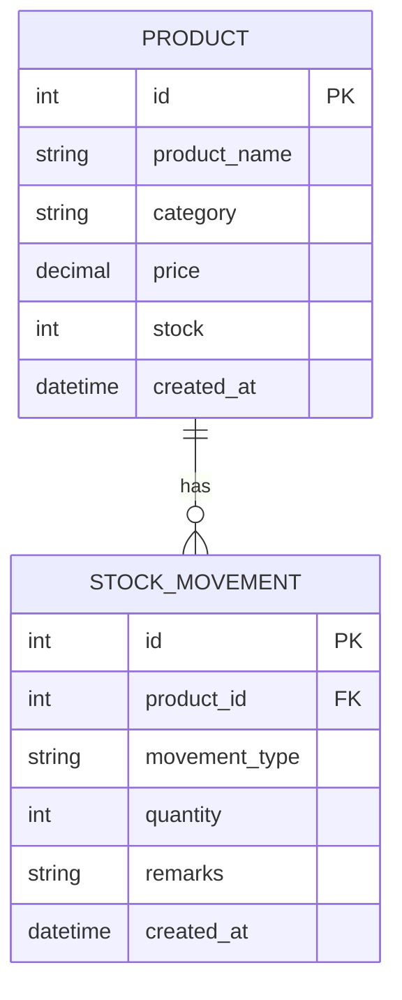

# Inventory Data Model

The midterm has no relational database. The following is the logical data model represented by the JSON mock store and OpenAPI schemas.

## Entities

### Product

| Field | Type | Required | Description |
|---|---|---:|---|
| `id` | integer | Yes | Internal product identifier |
| `product_name` | string | Yes | Product name |
| `category` | string | Yes | Inventory category |
| `price` | number | Yes | Unit price in Philippine pesos |
| `stock` | integer | Yes | Current quantity |
| `created_at` | date-time | Yes | Creation timestamp |

### StockMovement

| Field | Type | Required | Description |
|---|---|---:|---|
| `id` | integer | Yes | Movement identifier |
| `product_id` | integer | Yes | Product affected by movement |
| `product_name` | string | Yes in response | Display name resolved from Product |
| `movement_type` | enum | Yes | `IN` or `OUT` |
| `quantity` | integer | Yes | Quantity moved; minimum 1 |
| `remarks` | string | No | Reason or note |
| `created_at` | date-time | Yes | Movement timestamp |

## Logical ER diagram



## Data ownership

Inventory owns:

- product name;
- product category;
- product price;
- current stock quantity;
- stock movement history;
- low-stock calculation.

Other modules consume these values through the Inventory API rather than changing them directly.

## Sample mock data

The initial mock data is stored in `server/data/store.json` and includes:

- Pencil — 321 units — ₱10.00
- Printer Ink — 15 units — ₱850.00
- Bond Paper — 20 units — ₱250.00
- Notebook — 50 units — ₱45.00
- Ballpen — 115 units — ₱15.00

## Shared identifier proposal

For integration-facing references, Inventory proposes:

```text
INV-00001
INV-00002
INV-00003
```

The class-wide identifier must be confirmed with the other groups before final submission. The internal numeric `id` remains an implementation detail of the midterm mock API.
